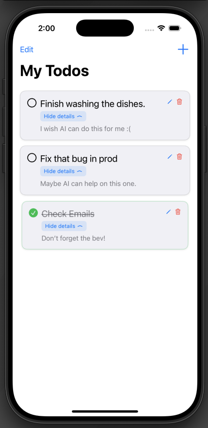
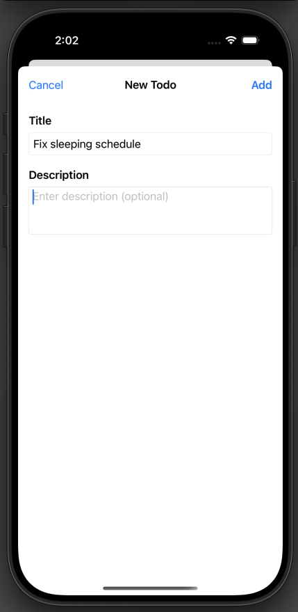
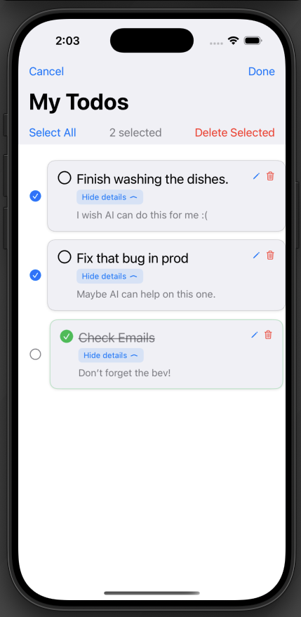

# MyTodoApp

## Project Ambition

A simple little project to familiarize myself with SwiftUI.

## App Usage

Users will be able to create, edit, and delete their Todo tasks.

## Project features:

    * Persistent storage
    * Button animations
    * SF Symbols

## Demo Screenshots

